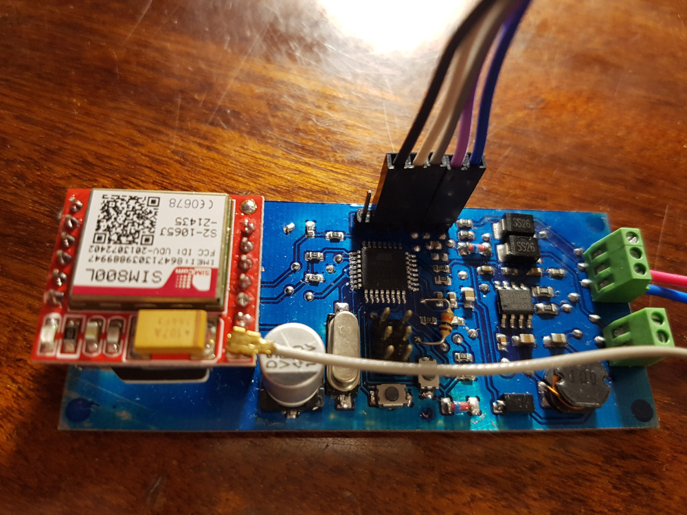

# GsmCarAlarm

This circuit is designed to work together with an existing alarm system that
does not have GSM module.

<figure>
    
</figure>

Features:

- Send status change notifications via SMS
- Call on status change to PANIC
- Backup power (9V battery)
- Can handle incoming call and response to DTMF commands:
  - Key 0: Tone response about status (one long signal means status is ARM, two
    short signals means status is DISARM)
  - Key 1: Send status SMS
  - Key 8: Re-initialize modem
  - Key 9: System reset
- Inform about car battery low or disconnected

Schematics diagram and PCB [here](https://oshwlab.com/lostclus/gsmcaralarm)
